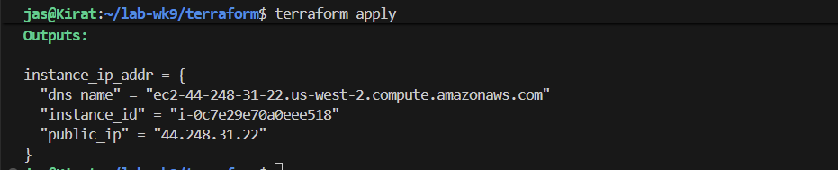
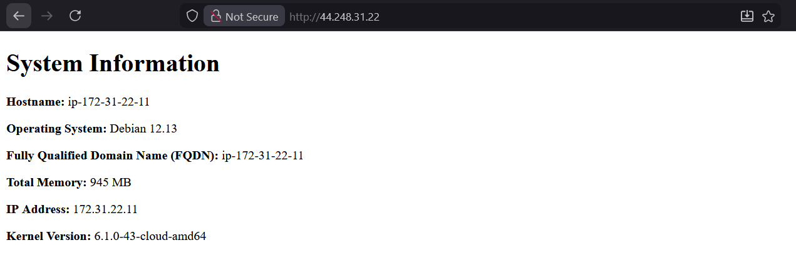

# 4640 week 9 lab

See lab instructions on D2L

1. Create ssh key:
```
ssh-keygen -t ed25519 -f ~/.ssh/wk9 -C "4640 week 9 lab key"
```

2. Run the `import_lab_key` script:
```
./scripts/import_lab_key ~/.ssh/wk9.pub
```

3. Create a new AMI using the Packer and Ansible configuration
```
cd ./packer
packer init .
packer validate .
packer build .
```

4. Run terraform
```
cd ../terraform
terraform init
terraform validate
terraform plan
terraform apply
```

Screenshot:


